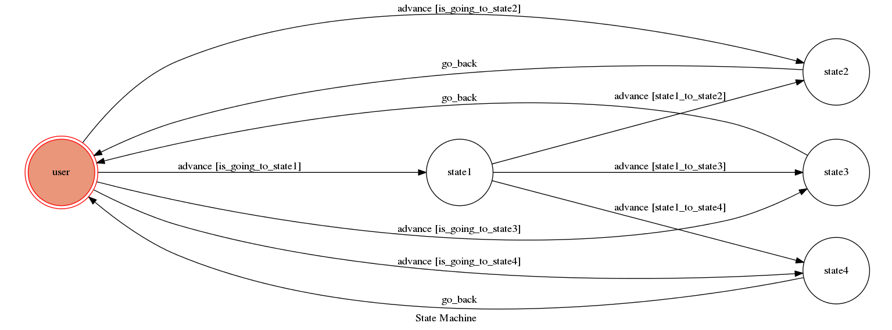

# Final Project F74040018

Theory of computation

A telegram bot based on a finite state machine

## Setup

### Prerequisite
* Python 3

#### Install Dependency
```sh
pip install -r requirements.txt
```

* pygraphviz (For visualizing Finite State Machine)
    * [Setup pygraphviz on Ubuntu](http://www.jianshu.com/p/a3da7ecc5303)

### Run Locally
You can either setup https server or using `ngrok` as a proxy.

**`ngrok` would be used in the following instruction**

```sh
ngrok http 5000
```

After that, `ngrok` would generate a https URL.

You should set `WEBHOOK_URL` (in app.py) to `your-https-URL/hook`.

#### Run the sever

```sh
python3 app.py
```

## Finite State Machine


## Usage
The initial state is set to `user`.

User can get some informations about three baseball team of Chinese Professional Baseball League.Include the picture of team logo,and the official wedsite of the team which is searched by user.

Input "list team" will show the name of team that user can search for.
Input team name will get the information about the team.
Then it will go back to user state after the bot trplies corresponding message.

* user
	* Input: "list team"
		* Reply: "you can search the official website of three baseball teams.just input 'lions' or 'brothers' or 'lamigo'"
		* And now you are in state1
	* Input: "lions"
		* Reply:"here is the website of lions" 
		* Show a picture of lions team and there official website URL
		* And now you are in state2
	* Input: "brothers"
		* Reply:"here is the website of brothers"
		* Show a picture of brothers team and there official website URL
		* And now you are in state3
    * Input: "lamigo"
		* Reply:"here is the website of lamigo"
		* Show a picture of lamigo team and there official website URL
		* And now you are in state4
* state1
    * Input: "lions"
		* Reply: Show a picture of lions team and there official website URL
		*  And now you are in state2
	* Input: "brothers"
		* Reply: Show a picture of brothers team and there official website URL
		*  And now you are in state3
    * Input: "lamigo"
		* Reply: Show a picture of lamigo team and there official website URL
		*  And now you are in state4

* state2, state3, state4
    * go back to user state automatically
## Author
[anguschiu](https://github.com/sss85921)
